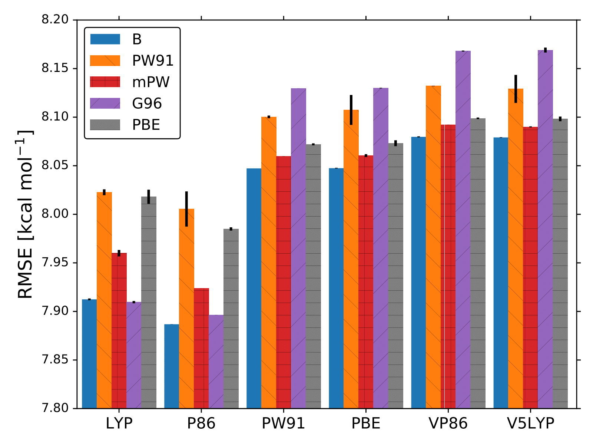
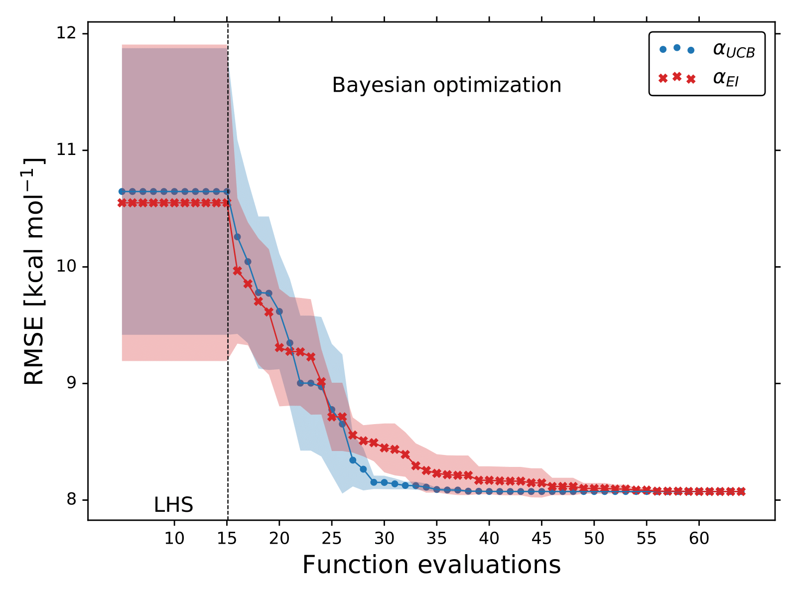

The results and idea presented in this post was published in:

Bayesian Optimization for Calibrating and Selecting Hybrid-Density Functional Models.\
[*J. Phys. Chem. A* **124**, 4053 (2020).](https://doi.org/10.1021/acs.jpca.0c01375)\
R. A.Vargas-Hernández\
Published as part of J. Phys. Chem. virtual special issue "*Machine Learning in Physical Chemistry*".

## (The Big Picture) Motivation behind the project

Density funcitonal theory (DFT) is probably one of the most used sucessfull theories developed by chemist. 
While in "principle" DFT is *ab initio*, in practice the majority of the DFT models depend on internal parameters that are tuned by comparison with experimental quantities, e.g., standard enthalpy of formation, atomization energies, ionization energies, to mention few. 

Back in my undergaduate, I modeled Diels–Alder reaction using variuos DFT models which forced me to review the bibliography to decider which was the *optimal* model  for my chemical system. 
The field of DF has created a large number of functionals [1], making it hard to select a single one for computational simulations.

The alphabet soup of approximate functionals available in a code near you, taken from Ref. [1].

At the end of my PhD I decided to test if we can optimize and select more efficiently DFT models with Bayesian Optimization.
Probably the two most common DFT models are **B3LYP**, Refs. [2-3], and **PBE0**, Refs. [4, 7-8]. However, this model belongs to a class of models called **ACM3**, Refs. [5-8].
This type of models was introduced by Becke, and combine local and non-local treatments of exchange (**X**) and cor- relation (**C**) with the Hartree-Fock (**HF**) exchange,

where , , and  are adjustable parameters.  and  are the generalized gradient approximation (GGA) exchange and correlation functionals, and  and  is the local spin density (LSD) part.
All the tunable parameters for this type of models are, . First, we will focuse on how standard BO can tune [formula](https://render.githubusercontent.com/render/math?math=a_0), , and .

The paremeters of **PBE0** are, , , and . For **B3LYP**,, , and .

In the Gaussian 09 suite, we can create 30 different ACM3 models. I tuned the , , and  constants by minimizng the root-mean-square error (RMSE) of the atomization energies of the G1 molecules, Refs. [9-11]. The entire data set consists of a total of 32 atomization energies.
For each XC functional we carried out 5 different optimizations with different 15 initial points.
These points were sampled using the latin hyper cube sampling (LHS) algorithm to avoid sampling multiple points close to each other. 
For all calculations we used **6-31G(*d*)** and the molecular geometries were optimized with **MP2/6-31G(*d*)**.
The lowest RMSE found by BO for each XC functional is displayed in the following Figures.

For this simulations we used the **Upper Confidence Bound** (UCB) acquisition function,

where the balacen between GP's meand standard deviation is balanced by the constant .

If we pay attention to the bar-plot figure for the 30 different models we can notice that not all models can reproduce the atomization energies with the same accuracy. For example, **B-P86** and **B-V5LYP** differ by more than 0.1 kcal/mol. 
Probably, this is the reason why the field of DFT relies on benchmark studies. Additionally, we can see that on average it only takes BO less than 40 evaluations of the RMSE function to spot the optmal values of , , and .

## References 

[1] K. Burke,
Perspective on density functional theory.
*J. Chem. Phys.* **36**, 150901 (2012)

[2] K. Kim, and K. D. Jordan,
Comparison of Density Functional and MP2 Calculations on the Water Monomer and Dimer.
*J. Phys. Chem.* **98**, 10089 (1994).

[3] P.J. Stephens; F. J. Devlin; C. F. Chabalowski; M. J. Frisch,
Ab Initio Calculation of Vibrational Absorption and Circular Dichroism Spectra Using Density Functional Force Fields. 
*J. Phys. Chem.* **98**, 11623 (1994). 

[4] M. Ernzerhof, and G. E. Scuseria,
Assessment and formal properties of exchange-correlation functionals constructed from the adiabatic connection.
*J. Chem. Phys.* **110**, 5029 (1999).

[5] A. D. Becke,
A new mixing of Hartree–Fock and local density‐functional theories.
*J. Chem. Phys.* **98**, 1372 (1993).

[6]A. D. Becke, 
Density‐functional thermochemistry. III. The role of exact exchange.
*J. Chem. Phys.* **98**, 5648 (1993).

[7] J. P. Perdew, M. Ernzerhof, and K. Burke,
Rationale for mixing exact exchange with density functional approximations. 
*J. Chem. Phys.* **105**, 9982 (1996).

[8] C. Adamo, and V. Barone,
Toward reliable density functional methods without adjustable parameters: The PBE0 model.
*J. Chem. Phys.* **110**, 6158 (1999).

[9] J.  A.  Pople,  M.  Head-Gordon,  D.  J.  Fox,  K.  Raghavachari,  and  L.  A.  Curtiss,
Gaussian‐1 theory: A general procedure for prediction of molecular energies.
*J. Chem.  Phys.* **90**,  5622 (1989). 

[10] L.  A.  Curtiss, C. Jones,  G.  w.  Trucks, K.  Raghavachari, and J.  A.  Pople,
Gaussian‐2 theory for molecular energies of first‐ and second‐row compounds.
*J. Chem.  Phys.* **93**,  2537 (1990).

[11] D. Feller, and K. A. Peterson,
Re-examination of atomization energies for the Gaussian-2 set of molecules.
*J. Chem.  Phys.* **110**, 8384 (1999).

