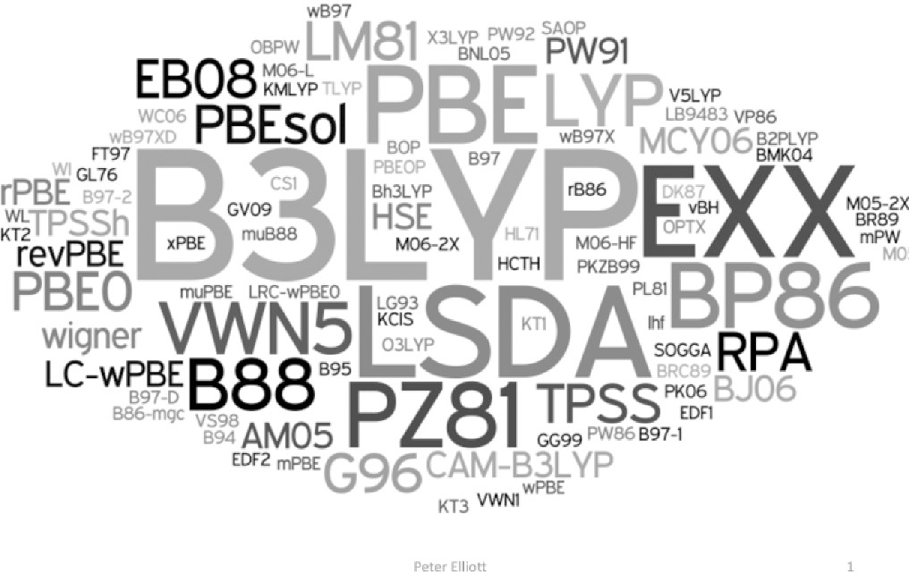

The results and idea presented in this post was published in:

Bayesian Optimization for Calibrating and Selecting Hybrid-Density Functional Models.\
[*J. Phys. Chem. A* **124**, 4053 (2020).](https://doi.org/10.1021/acs.jpca.0c01375)\
R. A.Vargas-Hernández\
Published as part of J. Phys. Chem. virtual special issue "*Machine Learning in Physical Chemistry*".

## (The Big Picture) Motivation behind the project

Density funcitonal theory (DFT) is probably one of the most used sucessfull theories developed by chemist. 
While in "principle" DFT is *ab initio*, in practice the majority of the DFT models depend on internal parameters that are tuned by comparison with experimental quantities, e.g., standard enthalpy of formation, atomization energies, ionization energies, to mention few. 

Back in my undergaduate, I modeled Diels–Alder reaction using variuos DFT models which forced me to review the bibliography to decider which was the *optimal* model  for my chemical system. 
The field of DF has created a large number of functionals [1], making it hard to select a single one for computational simulations.

At the end of my PhD I decided to test if we can optimize and select more efficiently DFT models with Bayesian Optimization.

## References 

[1] K. Burke,
Perspective on density functional theory
J. Chem. Phys. **36**, 150901 (2012)
