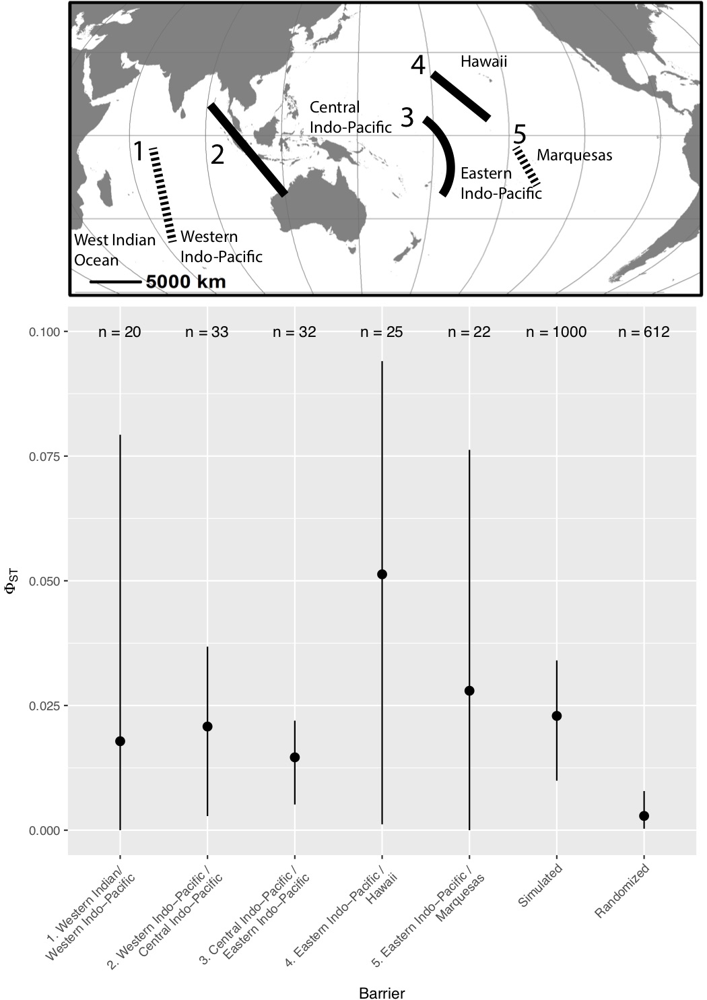

One of the first things we wanted to do for [(DIPnet)](http://diversityindopacific.net) was to get a clear sense of where things stand. So we went about assembling a large database of legacy mitochondrial sequence data, writing to authors around the world, who kindly shared their datasets with us. These data underwent rigorous QA/QC to verify things like the geographic origin of samples and their alignment with other datasets. In all we compiled more than 36,000 mitochondrial sequences from over 200 species (Figure 1), finally creating a dataset that was perhaps first envisioned by Palumbi (1997)! These data are at the core of the new Genomics Observatories Metadatabase [(GeOMe)](https://geome-db.org), which I will discuss in another blog post.

[Figure 1 - Distribution of sequences and species for our DIPnet database](../img/DIPnet_GeOMe.png)

We wanted to know what all these data, accumulated over two decades, might have to say in aggregate about patterns of genetic structure and diversity in the Indo-Pacific. [We started with structure, asking whether genetic structure in 56 Indo-Pacific species could support any of the numerous biogeographic regionalizations (i.e. ways of breaking the giant Indo-Pacific into smaller chunks)](https://onlinelibrary.wiley.com/doi/full/10.1111/geb.12905). For example, Brian Bowen and Jack Briggs (2012) broke the Indo-Pacific into 5 chunks based on fish endemism, whereas Spalding et al. (2007) created a hierarchical system of 3 realms broken into smaller provinces and even smaller regions. We reasoned that any process that creates recognizable turnover in species composition in various parts of the Indo-Pacific should also be reflected by haplotype frequency differences (as measured by $\Phi_(st)$) within species that span a hypothesized break. To test each hypothesis against each species dataset, we modified the Analysis of Molecular Variance (AMOVA) to produce Bayesian Information Criterion scores, thus allowing a model-selection approach.

I'm afraid our results are a bit of a mess (Figure 2). There was no clear "winner" among the regionalizations that we tested, other than that more species favored regionalizations with fewer regions, and there was no clear taxonomic pattern. Now we had to look at this first, but this result was not a big surprise to us (these data had been published previously). After all, the Indo-Pacific is BIG, and the metapopulations we are dealing with are HUGE! These species fall into that area of population genetic parameter space with high effective size and high gene flow that I have taken to calling the "Waples Zone" (after Robin Waples' foundational 1998 paper). $F_(st)$ and its analogs are expected to be very close to zero in the Waples Zone.

In the end, we took a look at the large regions hypothesized by both Briggs and Bowen (2012) and Spalding et al. (2007), and measured pairwise $\Phi_(st)$ across each of the boundaries (Figure 3). Sure enough, we found median $\Phi_(st)$ to be less than 0.025 across all of these putative "barriers." That doesn't mean that there is high (or even any) gene flow between these populations though. I did a simple set of coalescent simulations for a population with 500K effective individuals which split 10K generations ago into two populations of 250K with no gene flow between them. Median $\Phi_(st)$ for this set of simulations was 0.023 - right in line with what we observed across the putative barriers.

At the risk of sounding grandiose, this paper reminds me of the black hole photo we all saw recently, maybe not in total scope, but in that it involved collaboration and coordination by scientists around the world (21 co-authors, over 30 consortium authors through DIPnet) and some sophisticated analysis to yield what is ultimately a fairly blurry and granular picture of population structure in the Indo-Pacific. However, it points to the power of international collaboration and the new insights we can gain when we work together.

### Biography
[Eric Crandall](http://www.ericcrandall.org) is an Assistant Professor at California State University Monterey Bay. His research focuses on the evolutionary consequences of larval dispersal in marine organisms, with a particular focus on defining population structure. 

### Literature Cited

Briggs JC, Bowen BW. 2012. A realignment of marine biogeographic provinces with particular reference to fish distributions. Journal of Biogeography 39:12–30.

Crandall ED, Riginos C, Bird CE, Liggins L, Treml E, Beger M, Barber PH, Connolly SR, Cowman PF, DiBattista JD, ... Gaither MR. 2019. The molecular biogeography of the Indo‐Pacific: Testing hypotheses with multispecies genetic patterns.  Global Ecol Biogeogr 58:403–418. http://doi.org/10.1111/geb.12905

Palumbi S. 1997. Molecular biogeography of the Pacific. Coral Reefs 16:S47–S52.

Spalding MD, Fox HE, Halpern BS, McManus MA, Allen GR, Davidson N, Jorge ZA, Lombana AL, Lourie SA, Martin KD, et al. 2007. Marine ecoregions of the world: A bioregionalization of coastal and shelf areas. BioScience 57:573–583.

