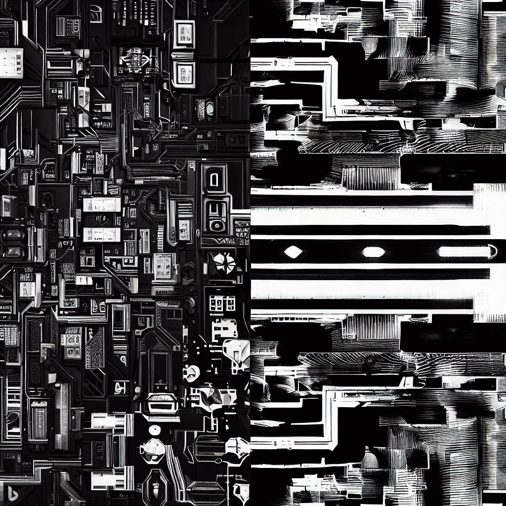

{:class="img-responsive"}

I find myself often in discussions about architecture and design patterns, two key elements that shape the way we build and comprehend software systems. Despite their inherent differences, the two terms are often confused or used interchangeably, even by experienced professionals. To bring clarity, I'd like to delve deeper into the meaning of these concepts and highlight some of the prevalent patterns and architectural styles in use today.

## Architecture and Design Patterns: A Clarification

Starting with architecture, it's best to think of it as the high-level blueprint of a software system. It provides a structured solution to meet technical and operational requirements while optimizing common quality attributes like performance, security and manageability. The architecture outlines the system's organization, major components, their interactions, and the architectural styles and patterns used.

On the other hand, design patterns are more granular, localized solutions to recurrent design problems. They are templates formulated by experienced software professionals, encapsulating proven practices that can be used to address specific issues in the context of coding and design.

In essence, while architecture offers a bird's eye view of the software structure, design patterns dive into the trenches, furnishing a reusable solution to a recurring problem within that structure.

## Exploring Major Architectural Styles 

1. Microservices Architecture: Microservices architecture has become prevalent in today's application development landscape. It involves designing a single application as a suite of small services, each running its own process and communicating through lightweight mechanisms. This architecture promotes the decoupling of components, making the system more flexible and resilient.

2. Serverless Architecture: Serverless architecture, often used with cloud computing, allows developers to build and run applications without managing servers. The server management is abstracted away by the cloud provider, allowing developers to focus more on the core functionality. This architectural style is increasingly popular due to its scalability and cost-effectiveness.

3. Event-Driven Architecture: In an event-driven architecture, the flow of the program is determined by events such as user actions, sensor outputs, or message passing from other programs. This architecture is highly adaptable and is especially useful for applications that require real-time responsiveness and scalability.

4. Domain-Driven Design (DDD): Domain-Driven Design is an approach that centers the software development around the core domain and its logic. This approach breaks down a complex system into manageable parts, known as Bounded Contexts. Each Bounded Context corresponds to a subdomain and encapsulates its complexities. The main components of DDD are Entities, Value Objects, Aggregates and Domain Events. By using a model based on the deep understanding of the business domain, DDD proves invaluable for handling complex behaviors, logic, and rules. This focus on the business domain encourages a creative collaboration between technical and domain experts, leading to software that is finely tuned to business needs.

## Examining Prominent Design Patterns

1. Factory Pattern: A creational design pattern, the Factory Method provides an interface for creating objects in a superclass, but allows subclasses to alter the type of objects that will be created. This promotes code reuse and enhances code maintainability.

2. Observer Pattern: This is a behavioral design pattern that allows objects to notify other objects about changes in their state. The Observer Pattern is widely used in GUI toolkits and event-driven systems.

3. Decorator Pattern: As a structural design pattern, the Decorator Pattern allows you to add new behaviors to objects dynamically by placing these objects inside special wrapper objects. It's an excellent alternative to subclassing when you need to extend functionality.

4. Repository Pattern: The Repository design pattern is a popular pattern often used in conjunction with DDD. It provides a bridge between the domain and data mapping layers, using a collection-like interface for accessing domain objects. A Repository abstracts the underlying data store and provides a more object-oriented view of the persistence layer. It encapsulates all the code required to persist aggregates and entities, providing an illusion of an in-memory collection of all objects of a particular type. By using the Repository pattern, the application remains agnostic of the underlying persistence system, allowing the focus to remain on business logic rather than data access details.

## Conclusion:
In conclusion, the architectural approach and design patterns we choose to implement can significantly impact the effectiveness of our software development. From high-level perspectives provided by architectures like Microservices, Serverless, Event-Driven and Domain-Driven Design, to specific, reusable solutions offered by design patterns like Factory, Observer, Decorator, and Repository, these concepts all play crucial roles. As we build and evolve our systems, understanding these roles and effectively leveraging these tools is key to creating robust, scalable, and maintainable software systems. And while it's certainly possible and often beneficial to mix different architectures and design patterns in the same solution, it's crucial to do so thoughtfully and judiciously, ensuring that the complexity of the system is justified by the problems it's solving.