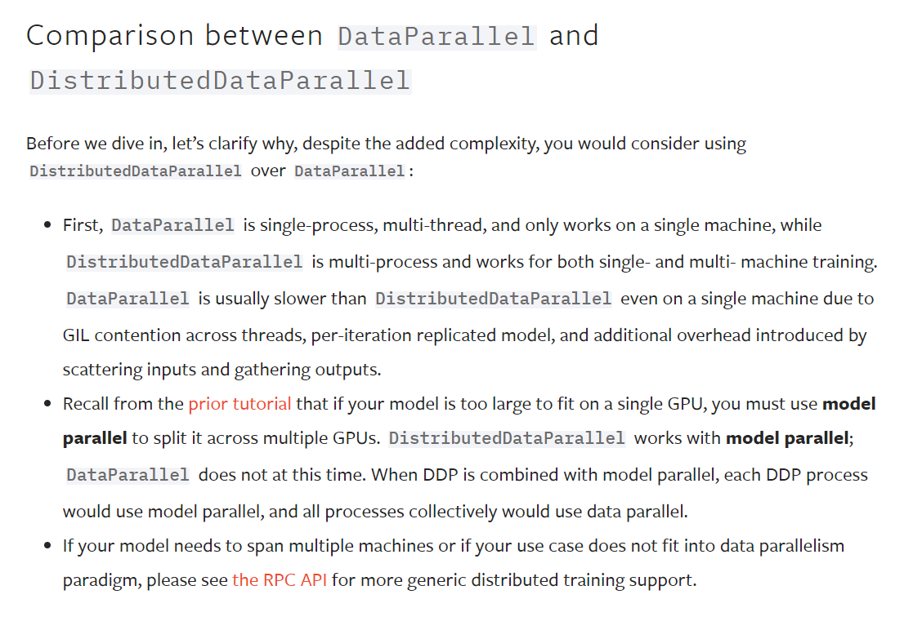

파이토치를 이용한 병렬 및 분산 학습 전반에 대해 정리하였다.

## 1. 개념
distributed 패키지는 아래 3가지 카테고리로 구성된다.
#### Distributed Data-Parallel Training(DDP):   
 하나의 프로그램으로 여러 다른 데이터 셋을 돌린다는 패러다임으로, 모델이 모든 프로세스에 복제된 뒤, 각 프로세스는 다른 입력데이터 셋을 가지게 된다.   
gradients의 계산과 계산값은 프로세서간 communications을 통해 공유되고 모델 학습을 가속화한다.   

#### RPC-Based Distributed Training(RPC):   
 RPC는 remote procedure call의 약자로 별도의 원격 제어를 위한 코딩 없이 다른 주소 공간에서 함수나 프로시저를 실행할 수 있게 하는 프로세서간
통신 기술이다. 즉 RPC는 함수가 로컬에 위치하든 원격 위치에 위치하든 동일한 코드를 이용할 수 있다.   
RPC-Based Distributed Training 기법은 DDP 개념을 머신의 경계없이 분산된 자원으로 학습할 수 있는 패러다임을 말한다.   

#### Collective Communication(c10d):   
 c10d 라이브러리는 하나의 그룹 내에서 프로세스간 텐서 통신을 지원한다.
collective communication APIs(e.g. all_reduce and all_gather)와 P2P communicationsAPIs(e.g. send and isend)를 제공한다.   
   DDP와 RPC(ProcessGroup Backend)들이 c10d에 빌트인되어있는데, 전자는 collective communications, 후자는 P2P communication에 사용된다.  
 개발자는 DDP와 RPC APIs가 워낙 다양한 분산 학습 시나리오에 맞게 설계되었기 때문에, 이런 raw communication API를 자주 사용하지는 않겠지만, 통신구조를 low하게 수정하고 싶을 때 사용될 수 있다.  
 일례로 distributed parameter averaging이 있다. DDP를 이용해 gradients를 통신하는 것 대신, 역전파 이후 모든 모델의 파라미터에 대한 평균값을 계산할 때 쓰일 수 있다.   
 이 방법을 통해 텐서 통신에 대한 finer-grain control이 가능하다.   
 대신 DDP에 의한 성능 최적화를 포기해야 하는 단점이 있다. 

## 2. Data Parallel Training
### 개발 환경에 따른 distributed 모듈 사용 방법
#### single machine with one GPU : Normal
데이터와 모델이 한 개의 GPU로 충분하고, 학습속도가 중요하지 않은 경우.   
#### single machine with multi GPU : DataParallel
적은 코드의 수정만으로 여러 개의 GPU를 사용해 학습을 가속화시킬 경우.  
#### single machine with multi GPU : DistributedDataParallel
DataParallel을 쓸 때 보다는, 좀 더 코드를 수정해 학습속도를 더 개선하고 싶은 경우.   
아래 내용을 참고했을 때, GIL 문제로 DataParallel을 사용하기보다 DistributedDataParallel을 사용하는 것이 좋다.
[링크](https://pytorch.org/tutorials/intermediate/ddp_tutorial.html)

#### multi machine : DistributedDataParalled and launcing script
여러 개의 머신을 사용할 경우.
#### 컴퓨팅 자원이 수시로 변경되는 상황 : torch.distributed.elastic
컴퓨팅 자원이 다이나믹하게 추가되거나 제거되면, out-of-memory 등 여러 학습 오류를 발생시킬 수 있다.  
이런 문제들을 해결하기 위한 경우.

### torch.nn.DataParallel (DP)
DataParallel package는 single process multi-thread 병렬화 방식으로 단 한줄의 소스 코드만 추가하면 multi-GPU를 사용하게 해준다.  
따라서 사용하기 매우 편한 장점이 있지만, GIL로 인해 쓰레드간 GIL 경합, 복제 모델의 반복 당 생성, 산란 입력 및 수집 출력으로 인한 추가적인 오버헤드가 발생해 성능이 좀 떨어진다.
   
### torch.nn.DistributedDataParallel (DDP)
DDP는 multi-process parallelism을 사용하며 GIL 문제로 인한 문제를 줄여 single machine에서도 학습 속도를 개선한다.
  
DDP와 관련된 글이다.
- [DDP NOTES](https://pytorch.org/docs/stable/notes/ddp.html) : DDP 패키지를 사용한 간단한 구현 예시를 보여준다. DDP를 처음접할 때 보면 좋은 문서.
- [Getting Started with Distributed Data Parallel](https://tutorials.pytorch.kr/intermediate/ddp_tutorial.html) : DDP를 사용한 학습에서 공통적으로 나타나는 문제
(unbalanced workload, checkpointing and multi-device model)들을 설명한다. 
기타 글들은 아래 공식 문서 참조.  

## 3. RPC-Based Distributed Training
Many training paradigms do not fit into data parallelism, e.g., parameter server paradigm, distributed pipeline parallelism, reinforcement learning applications with multiple observers or agents, etc. torch.distributed.rpc aims at supporting general distributed training scenarios.

torch.distributed.rpc has four main pillars:

RPC supports running a given function on a remote worker.

RRef helps to manage the lifetime of a remote object. The reference counting protocol is presented in the RRef notes.

Distributed Autograd extends the autograd engine beyond machine boundaries. Please refer to Distributed Autograd Design for more details.

Distributed Optimizer automatically reaches out to all participating workers to update parameters using gradients computed by the distributed autograd engine.

RPC Tutorials are listed below:

The Getting Started with Distributed RPC Framework tutorial first uses a simple Reinforcement Learning (RL) example to demonstrate RPC and RRef. Then, it applies a basic distributed model parallelism to an RNN example to show how to use distributed autograd and distributed optimizer.

The Implementing a Parameter Server Using Distributed RPC Framework tutorial borrows the spirit of HogWild! training and applies it to an asynchronous parameter server (PS) training application.

The Distributed Pipeline Parallelism Using RPC tutorial extends the single-machine pipeline parallel example (presented in Single-Machine Model Parallel Best Practices) to a distributed environment and shows how to implement it using RPC.

The Implementing Batch RPC Processing Using Asynchronous Executions tutorial demonstrates how to implement RPC batch processing using the @rpc.functions.async_execution decorator, which can help speed up inference and training. It uses RL and PS examples similar to those in the above tutorials 1 and 2.

The Combining Distributed DataParallel with Distributed RPC Framework tutorial demonstrates how to combine DDP with RPC to train a model using distributed data parallelism combined with distributed model parallelism.

### 기타
- open-mmlab을 포함한 몇몇 오픈 소스에서 사용되는 torch.distributed.launch는 deprecated되었으므로 torchrun를 사용해야 함.
https://pytorch.org/docs/stable/elastic/run.html

### @ 참고
[overview 공식](https://tutorials.pytorch.kr/beginner/dist_overview.html)    
[torch tutorial](https://tutorials.pytorch.kr/intermediate/dist_tuto.html)

2. 한글 설명자료
https://hongl.tistory.com/291
https://medium.com/daangn/pytorch-multi-gpu-%ED%95%99%EC%8A%B5-%EC%A0%9C%EB%8C%80%EB%A1%9C-%ED%95%98%EA%B8%B0-27270617936b

4. RPC
https://ko.wikipedia.org/wiki/%EC%9B%90%EA%B2%A9_%ED%94%84%EB%A1%9C%EC%8B%9C%EC%A0%80_%ED%98%B8%EC%B6%9C