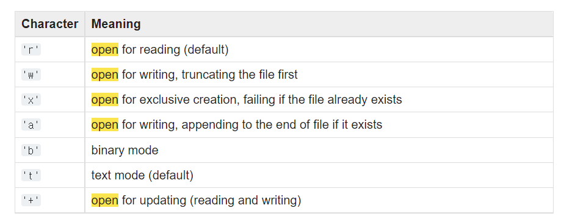

파이썬에 있는 모든 객체는 pickle로 저장이 가능하다. pickle은 바이너리 파일로 저장이 된다.

## 1.모듈 설치
내장 라이브러리라 import만 하면 된다.
```
import pickle
```
## 2. 기능
예시데이터 : test_dict = {'name': "test", 'pw': "1234"}

# 데이터 로드
with open('filename.pkl', 'rb') as f:
	data = pickle.load(f)

# 데이터 저장
with open('filename.pkl', 'wb') as f:
	pickle.dump(test_dict, f, protocol=pickle.HIGHEST_PROTOCOL)
    
# *with open 문법
파이썬에서 파일 입출력을 위해, 파일을 여는 open과 close 내장함수가 지원된다.

open함수는 아래와 같다.
```python
open(file, mode='r', buffering=- 1, encoding=None, errors=None, newline=None, closefd=True, opener=None)
```
mode에는 아래와 같은 옵션을 줄 수 있다.


open함수를 호출한 후 자원반환을 위해 close를 불러와야 하는데, 이를 with문을 이용해 블록이 끝날 때 자동으로 처리할 수 있다.
```python
with open('file.md') as f:
	print(f.readline(), end="")
```
## @참고
https://docs.python.org/3/library/pickle.html
https://seing.tistory.com/95


