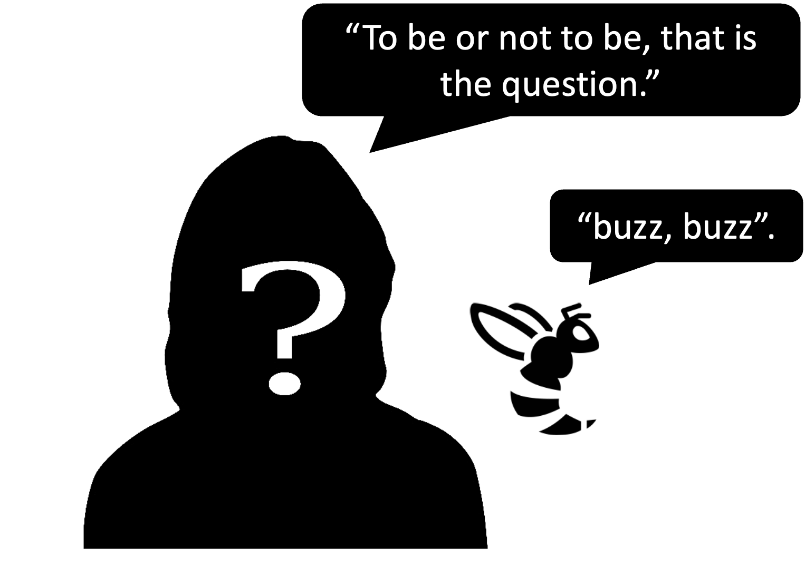

<style>
table {
margin: auto;
}
.table td, .table th {
        font-size: 10px;
    }
</style>


## Introduction

Quotations, the repetition of well-known statement parts, have preserved and inherited wisdoms and perspectives 
that significantly changed the world. And we not only focus on the power of the words, but also the people who speaked 
them. There are lots of famous quotations that we can instantly identify the speakers. However, we can find a large 
number of quotations whose speakers are unidentifiable. We may never know their names, but is that possible to find 
other more details about their profiles? 

{: .mx-auto.d-block :}
<!--  -->

Our project, **DescribeByQuote**, aims to detect the profiles of the speakers from the quotations based on deep learning
methods. While performing analysis of Quotebank data we found out that around **34%** of quotations don't have assigned 
speakers to it (e.g., 1.8 million out of 5.2 million in file quotes-2020.json). Our goal is to answer the following question: if we cannot determine the exact author of a quotation, what other information can we get from it? We would like to achieve this by training the deep learning models that can help to classify with different features.

In that work, first we would need to generate labels for our quotations, which requires extra information. Therefore, we extracted those additional information about known authors of the quotations by parsing their information from **Wikipedia**. Through filtering and parsing, we successfully extracted six important features of the speakers as the labels for the data, including ```Gender, Occupation, Nationality, Ethic group, Date of birth, and Religion```. 

<!-- | Feature Name | Class Number| 
| :----- | :----- |
| Gender | 2 |
| Occupation | 10 |
| Nationality | 5 |
| Ethic Group | 10 |
| Date of Birth | 8 |
| Religion | 10 | -->

<table style='margin-left:auto;margin-right:auto'>
<tr>
        <td><b>Feature Name</b></td>
        <td>Gender</td>
        <td>Occupation</td>
        <td>Nationality</td>
        <td>Ethic Group</td>
        <td>Date of Birth</td>
        <td>Religion</td>
    </tr>
    <tr>
        <td><b>Class Number</b></td>
        <td>2</td>
        <td>10</td>
        <td>5</td>
        <td>10</td>
        <td>8</td>
        <td>10</td>
    </tr>
</table>

With the data and labels, we trained several models and verified the functionalities, then predicted the features of the 
quotatations that are not assigned speakers in Quotebank. Also, we did some analysis on the outcomes and explored the 
relationships between different features, as well as tried to understand the mechanism of the prediction.

## Data Preparation
Pawel write about data collection, why we choose these features, maybe smth else

## Data analysis
Katya write about initial analisys, also we should mention that the classes was so imbalance and that we balanced them for the training but no tfor the validation and test sets. Put 1 exapmle about men and women differences (2 diagrams in 1 line and explanations) and 1 example of balanced and imbalanced data for 1 feature (again 2 diagrams in 1 line with explanations)

## Deep Learning Model
Sofia section. Explain about our model

## Experiment


## Results and Analytics
Wei describes our results and asking question about correletions in the confusion matrix and why some classes prediciting much more better then others.
Here he will use confusion matrix plots and roc curves plots

## Data insights
During evaluating our model we noticed that some classes detected better than others. This fact prompted us to delve deeper into the data research in search of some insiders who most likely help our models classify the desired class.

We assumed that perhaps the same groups of people prefer similar topics for conversation, which may encourage our model to classify quotes into the classes we need. But to test this hypothesis, we need to understand the context of the quote. We noticed that in 2019, the source of 83% of citations is the New York Times. In the remaining years, NY also occupies a leading position in the list of sources of quotations. The peculiarity of NY is that there is a topic in the link to the quote, to which NY equated this quote. This fact helped us to find out the context of most of the quotes.

### Data preporation
For every feature as gender, occupation, etc. we selected quotes with New York Times source. For every such quote we extracted topic from  quotes link and (because sometimes links don't fit the format we expect ) we dropped all topics with total amount less than 400.
As a result for every feature we collected dataset with quotes topics.

### Data analysis
#### Gender
We found out that our model distinguishes both men and women with the same accuracy. For further analysis, we decided to draw a distribution of topics for each gender.
  
<span style="color:blue">Put here conclusion.</span>

#### Occupation
  
