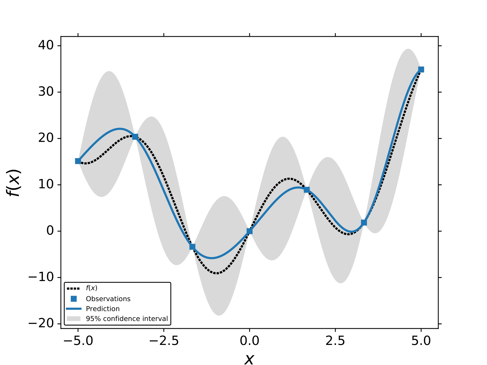
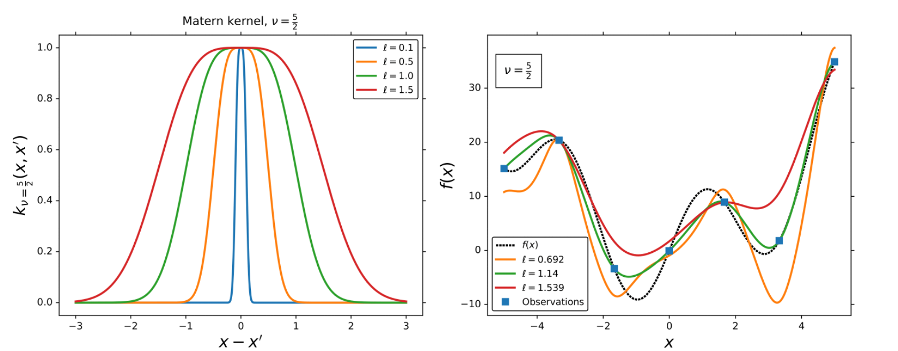
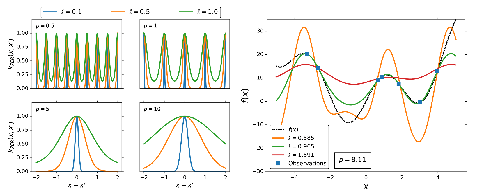
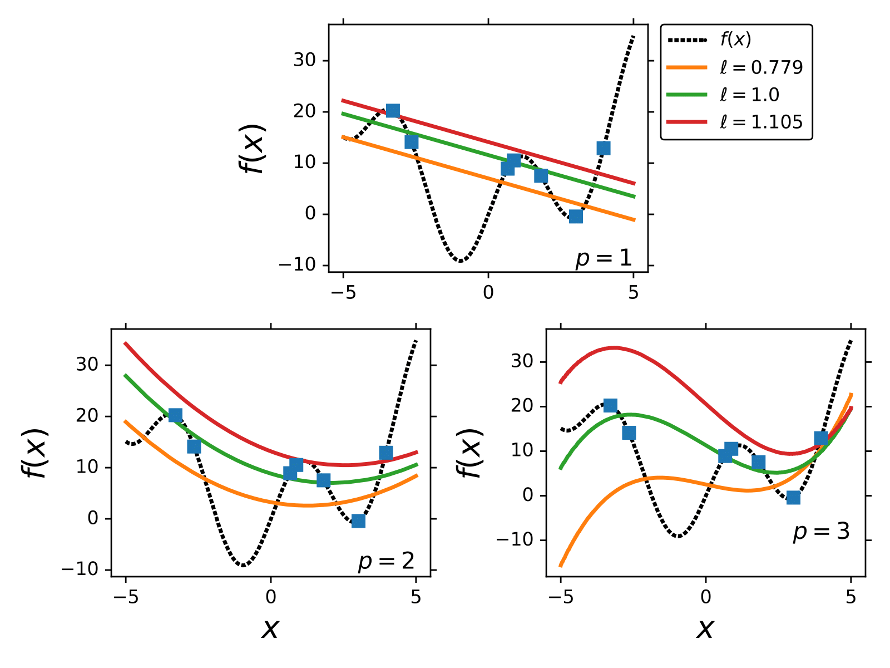

In the field of machine learning, the branch of supervised learning is focuse on the regression task, . 

Machine learning (ML) field is divided into three major areas; supervised, unsupervised, and reinforcement learning (MurphyMLbook,BishopMLbook,RLbook). 
Each of these three fields studies a particular task. In the case of supervised learning, the goal is to find the numerical mapping between an input  and an output . The numerical mapping can be viewed as, ). When the output value  is discrete, the problem is known as *classification*. On the other hand, when   is continuous is known as *interpolation*. This chapter describes one of the most common supervised learning algorithms Guassian process (GP) regression (GPbook). 

# Introduction
As in any other supervised learning algorithm, the goal of GP regression is to infer an unknown function ) by observing some input, , and output data, . 
We denote  as the training dataset that contains both  and .
 One of the few differences between GP regression and other supervised learning algorithms, like neural networks (NNs), is that GP infer a *distribution over functions* given the training data ). 
 
GPs are a probabilistic method and assume that each training point is a random variable and they have a joint probability distribution , \cdots, f(\mathbf{x}_N))). 
As its name suggests, GP assume that the joint distribution is Gaussian and has a mean ) and covariance ). 
The matrix elements of the covariance are defined as ) where ) is a positive defined kernel function. The kernel function plays a key role as it describes the *similarity* relation between two points.
A GP is denoted as,   \sim GP \left ( \mu(\mathbf{x}), K(\mathbf{x},\mathbf{x'}) \right)).

In the following sections, we describe the training and prediction of GP regression.

# Prediction with Gaussian Processes
GPs can also be considered as a generative model, however, one if its advantages is that their predictive distribution has a close form, meaning sampling techniques are not required. 
As it was mentioned above, a GP is the collection of random variables ) that follow a joint distribution. 
The joint Gaussian distribution between , , and ) is of the form,

where  is the covariance matrix of the training data *X*,  is the covariance matrix between *X* and , and  is the covariance with respect to itself. 

The probability distribution over ) can be inferred by computing the conditional distribution given the training data, ). 
Conditioning on the training data is the same as selecting the distribution of functions that agree with observed data points .
The mean and covariance matrix of the conditional distribution are,

 where  is the predicted variance for . The mean of the conditional distribution can be rewritten as,

where ^\top K(X,X)^{-1}) and  ^{-1}\mathbf{y}). 
The mean of the conditional distribution is a linear combination of the training data, , or a linear combination of the kernel function between the training points and . Function ) can be understood as a *distance* function.
It is important to state that the accuracy of the prediction with GPs directly depends on the size of the training data *N* and the kernel function ). In the following sections, we illustrate the impact that different kernels on GPs' prediction. 

In the GPs' framework, the predicted variance or standard deviation of  represents the uncertainty of the model. 
The uncertainty can be used to sample different regions of the function space to search the location of the minimum or maximum of a particular function.
This is the idea behind a class of ML algorithms known as Bayesian optimiation.

An example of GP regression for,
.
We use the *exponential squared* kernel  and 7 training points.
In the following section, we describe the most common procedure to train GPs.

# Training GPs
The goal of any supervised learning algorithm is to infer a function ), as accurately as possible, given some example data.
In order to quantify the accuracy of a model we define a *loss* function, , for example, the difference between the prediction  and the real value  (training points) such as  ^2) or .
The parameters of the model  and  are interconnected. 
To illustrate this idea let us assume that ) is a simple linear regression model, =a %2B bx). The loss function for such model is, 

From the previous equation, we can observe that the value of  depends on *a* and *b*. 
It can be argued that when  is large ) not equal to. On the other hand when  \approx \hat{y_i}) the value of  will tend to zero.
Using a loss function to tune the parameters of ) is known as the *training* stage in ML. 
It must be mentioned that replicating the training data could also mean that  the model ''memorize'' the training data. 
This common problem in ML is known as *overfitting*. 

GPs models can also be trained using a loss function. GP models are non- parametric models, therefore, the dimensionality of the loss function depends on the number of the parameters of the kernel function. Using a loss function to determine the optimal value for the kernel parameters for non-parametric models is computationally expensive and is prone to overfitting. However, it is possible to train GP methods without a loss function. The most common way to train GPs is by finding the kernel parameters (**θ**) that maximize the **marginal likelihood function**,

where  is the marginal likelihood for a given model or kernel function Mi. Finding the value of **θ** where  is maximized is known as type II maximum likelihood (ML-II). The marginal likelihood or evidence is defined as,

In the case of GPs, the marginal likelihood has a closed form. Finding the kernel parameters that maximize the marginal likelihood can be done by maximizing the logarithm of the marginal likelihood w.r.t to **θ**,

where the first term is known as the data-fit term, the second term reflects the complexity of the model , and the third term is a constant that depends on the number of training points, *N*. The value of  mainly depends on the data-fit and complexity terms. For instance, for a **θ** that memorizes the training data the value of log|K| is large, while 
 will be small. The tradeoff between the data-fit and the complexity term is key for the optimal value of the kernel parameters.

Standard gradient-based optimization algorithm is the most common method to find the optimal value of the kernel parameters. The logarithm of the marginal
likelihood has an analytic form, therefore, it is possible to compute the change of  as a function of the kernel parameters,  . For most cases, the function  is not a convex function; thus there is a possi- bility that the optimization algorithm gets trapped in one of the local maxima. For GP regression, the value of **θ** does depend on the training data y, and having different training data sets could lead to different values for the kernel parameters.

# Kernel Functions

In the previous sections, we explained how a GP model is trained and also how it can make predictions. We also assumed that GPs need a kernel function in order to construct the covariance matrices  and . In this section, we introduce various kernels that are used for training GPs and illustrate how prediction with GPs can drastically change depending on which kernel is used. As mentioned previously, the kernel function should describe the similarity between two points. In kernel regression, two points that are similar, under some metric, should have a similar output value , predicted by ).

The kernel function  ) must be a positive definite function; this restriction comes from the requirement to invert the covariance matrix during training and prediction. The covariance matrix must be a symmetric matrix which forces the kernel function to be symmetric too,   = k(\mathbf{x}',\mathbf{x})). The Cholesky factorization is the most common algorithm to invert matrices with  complexity where *N* is the number of training points.

All of the kernels that are used in this thesis are *stationary* kernels except for the linear kernel. Any stationary kernel can be rewritten in terms of the **Mahalanobis** distance,

The Mahalanobis distance reduces to the square of the Euclidian distance when all .  
Furthermore, when all  have the same value, the kernel function is an **isotropic kernel**. In the following sections, we list some of the most common kernels that are used in GP models.

## Constant kernel
The constant kernel, arguably the most simple kernel, assumes that the similarity relation between two points is constant,

The kernel parameter  can be optimized by maximizing the logarithm of the
marginal likelihood. ) is a one-time differentiable function.

## Square exponential kernel
The square exponential (SE) kernel, also known as the radial basis function (**RBF**) kernel, is probably the most used kernel in GP regression. The SE kernel is a stationary kernel since it depends on the difference between two points,

Each  defines the characteristic length-scale for each dimension. Depending on the user, the SE kernel can be isotropic, all  have the same value, or anisotropic, each  has a different value. As it was mentioned in the previous section, the values of each  are optimized by maximizing the logarithm of the marginal likelihood. The training of an isotropic SE kernel is faster since the total number of parameters in the kernel is one, while anisotropic SE kernels have *d* parameters, *d* is the dimension of **x**. The SE kernel is infinitely differentiable.

## Matern kernel
The Matern  (MAT) kernels are probably the second most used kernel for GPs,

## Rotational Quadratic kernel
The Rational quadratic kernel (RQ) is also a stationary kernel,

where  and  are the kernel parameters. In the limit of  to infinity, the RQ kernel is identical to the SE kernel. 

## Periodic kernel
None of the previously mentioned kernels are capable of describing periodic functions. Periodicity can be described by trigonometric function like cos(x), or sin(x). Since any kernel function must be a semi-positive define function, ) and  ) are the only capable trigonometric functions that can be used
as kernel functions. The periodic (PER) kernel has the form,

where *p* and  are the kernel parameters. *p* describes the intrinsic periodicity in the data and  is the length-scale parameter. 

## Linear (Polynomial) kernel
The linear kernel (LIN) is a *non-stationary* kernel and is also known as the dot product kernel,

where  is the offset value of the kernel. 
If  the linear kernel is considered to be *homogenous*. A more general form of the linear kernel is, , where [formula](https://render.githubusercontent.com/render/math?math=\Lambda) is a diagonal matrix with unique length-scale parameters for each dimension in **x**. The linear kernel is the base of the polynomial kernel,

where *p* is the polynomial degree.

